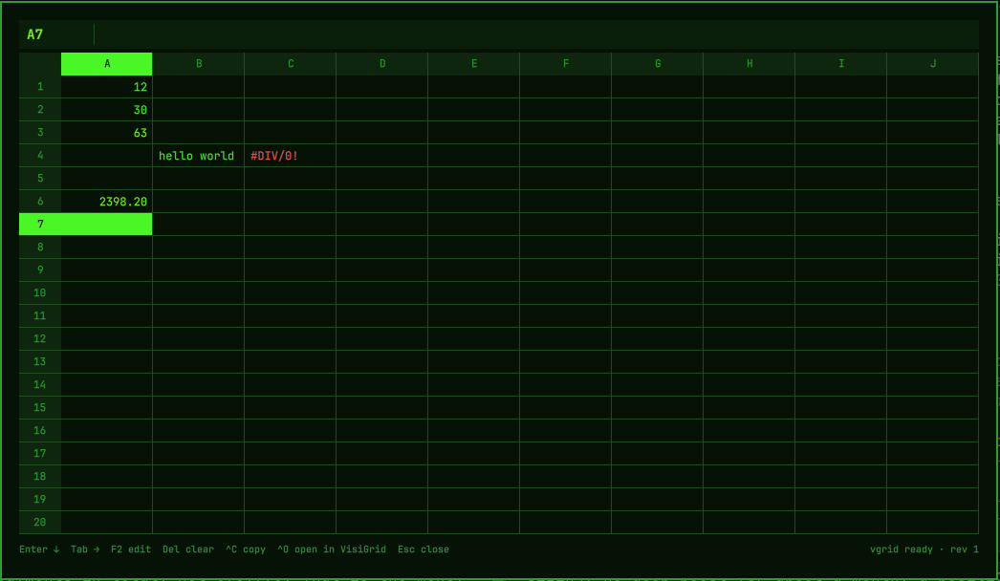

# VisiGrid Scratch

A persistent scratch spreadsheet that drops down over your Omarchy desktop.
It replaces the pop-up calculator: type numbers and formulas, close it, and
everything is still there next time. The math is done by the real
[VisiGrid](https://visigrid.app) engine running headless, so the whole
function library works (`=SUM`, `=PMT`, `=VLOOKUP`, dates, text, …).



## Requirements

- Omarchy with the Quattro shell.
- The `vgrid` CLI, which ships with VisiGrid:

  ```bash
  omarchy pkg aur add visigrid-bin
  ```

  Any install that puts `vgrid` on your `PATH` works (see
  [visigrid.app/download](https://visigrid.app/download)). The plugin shows an
  install hint in its status line when `vgrid` is missing.

## Install

```bash
omarchy plugin add https://github.com/VisiGrid/omarchy-scratch.git --enable
```

Then bind a key. Add this to `~/.config/hypr/bindings.lua` to take over the
calculator shortcut:

```lua
hl.unbind("SUPER + CTRL + Q")
o.bind("SUPER + CTRL + Q", "Scratch grid", "omarchy-shell shell toggle visigrid.scratch")
```

Or keep the calculator and pick another key. The plugin can also be opened
from any script with `omarchy-shell shell toggle visigrid.scratch`.

For the drop-down slide, add a layer rule to `~/.config/hypr/hyprland.lua`
(or any file it requires):

```lua
hl.layer_rule({ match = { namespace = "visigrid-scratch" }, animation = "slide top" })
```

## Usage

| Key | Action |
|-----|--------|
| type | start editing the active cell (replaces its contents) |
| `F2` | edit the active cell in place |
| `Enter` / `Shift+Enter` | commit and move down / up |
| `Tab` / `Shift+Tab` | commit and move right / left |
| arrows, `PgUp`, `PgDn`, `Home`, `Ctrl+Home` | move; the grid scrolls when you hit an edge |
| `Delete` / `Backspace` | clear the active cell |
| `Ctrl+C` / `Ctrl+Shift+C` | copy the cell's value / its formula |
| `Ctrl+O` | save and open the sheet in the VisiGrid app |
| `F11` | toggle between full width and a fitted sheet |
| `Esc` | cancel the edit, or close the overlay |

Formulas start with `=`. Mouse: click selects, double-click edits, wheel scrolls.

### Vim mode

Set `"vim": true` in the settings file (below). The bindings mirror VisiGrid's
own vim mode:

| Key | Action |
|-----|--------|
| `h` `j` `k` `l` | move |
| `0` / `$` | first column / last filled column in the row |
| `w` / `b` | next / previous filled cell in the row |
| `gg` / `G` | top-left / last filled row |
| `i` / `a` | edit with the cursor at the start / end |
| `x` | clear the cell |

Digits, `=`, `+`, `-` and `.` still start an edit directly, so `2+2` never
needs an `i` first. Other letters are ignored in normal mode.

The sheet lives at `~/.local/state/visigrid/scratch.sheet`. It is a normal
VisiGrid file: open it in the app, share it, or `vgrid peek` it from a terminal.

## Configure

Optional settings file at `~/.config/visigrid/scratch.json` (hot-reloads):

```json
{
  "theme": "phosphor",
  "rows": 15,
  "cols": 0,
  "width": "full",
  "font": "",
  "vim": false
}
```

- `theme`: `phosphor` (VisiCalc green, the default) or `system` (follows your
  Omarchy theme).
- `rows`: visible rows (5–60).
- `width`: `full` spans the monitor; `fit` is a centered sheet just wide
  enough for `cols` columns (10 when `cols` is 0); `"60%"` or a pixel count
  like `1200` gives a fixed width. Always centered and flush with the top.
  `F11` flips between `full` and `fit` until the shell restarts.
- `cols`: fixed column count (3–26), or `0` to fit as many 128px columns as
  the width holds.
- `font`: font family override; empty uses the shell's menu font.
- `vim`: `true` enables the vim bindings above.

## How it works

The plugin starts one `vgrid serve` process that owns the sheet and autosaves
it. Every edit is one JSONL operation piped to `vgrid apply`; every refresh is
one `vgrid inspect --json` of the visible range. The session token is generated
per shell session and never written to disk. Nothing leaves your machine.

## Remove

```bash
omarchy plugin remove visigrid.scratch
```

Your sheet stays in `~/.local/state/visigrid/` until you delete it.

## License

MIT. VisiGrid itself is AGPL-3.0; this plugin only talks to its CLI.
